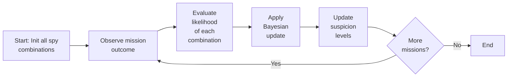
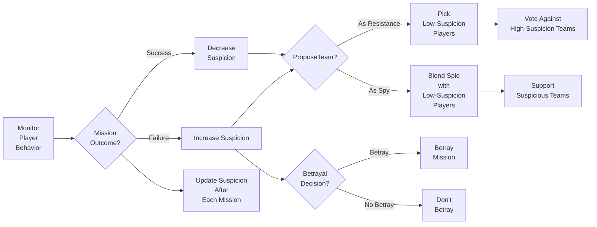

# CITS-3011 Project  
**`Some mathematical expressions are not displayed, please check README.pdf`**

## 1. **Introduction**
   - **Background**: We will develop an agent for The Resistance, aiming to outperform reference agents. strategies.
   - **Overview**:My development focused on three agents: **Heuristic -> Bayesian -> Bayesian_Heuristic**; The **`Bayesian_Heuristic`** integrates multiple techniques, and during this process, I conducted horizontal testing and analysis across all agents to refine and optimize its performance
   


## 2. **Merits of Multiple Techniques**
  #### 2.1. **Bayesian Inference**  
   - **Advantage 1**: Provides precise probabilistic updates as more data accumulates. Helps the agent make accurate long-term predictions by refining suspicion levels with each mission outcome.
   - **Advantage 2**: Strong in the later stages of the game where sufficient data allows for accurate identification of spies based on mission and voting outcomes.
   - **Limitation**: Relies on accumulating sufficient data, making it less effective in early stages when there's little information to base predictions on.

  #### 2.2. **Heuristic Based on Behavior**  
   - **Advantage 1**: Reacts quickly to immediate behavior, such as voting patterns or mission success/failure, without needing extensive historical data.
   - **Advantage 2**: Flexible and adaptable, especially useful in early game stages when data is scarce. The agent can make reasonable decisions based on observed behavior, filling the gap where Bayesian inference struggles.
   - **Limitation**: Lacks the precision of Bayesian inference for long-term decision-making, as it relies on surface-level behavior rather than deep probabilistic analysis.
   #### 2.3. **Heuristic Based on Suspicion Accumulation**  (Used in heuristic agent; not used in final version)
   - **Advantage 1**: Dynamically increases suspicion based on repeated suspicious behavior (e.g., proposing or voting for failed missions), helping to catch spies early.
   - **Advantage 2**: Enhances adaptability by steadily building suspicion, even when exact probabilistic data is lacking.
   - **Limitation**: Can be overly reactive, increasing suspicion too quickly without solid evidence, leading to potential misjudgments.

## 3.  `Bayesian_Heuristic` agent Technical effectiveness
### **3.1  Effectiveness of each Technical**
#### 3.1.1 Bayesian Suspicion-update Process



1. **Initialize all possible spy combinations** with equal probabilities.
   - Start with all spy combinations assigned equal probabilities. For example, if there are 5 players and 2 spies, each combination has a probability of \( \frac{1}{10} \).

2. **Observe the mission outcome**, including success/failure and number of betrayals.
   - After each mission, the agent observes the outcome and the number of betrayals, providing evidence \( E \) for the Bayesian update.

3. **Evaluate the likelihood** of each spy combination.
   - Calculate how likely each spy combination \( H_i \) would result in the observed number of betrayals. For example, if two spies were on the mission but only one betrayal occurred, this reduces the likelihood for combinations with both spies present.

4. **Apply the Bayesian update**:
   - For each spy combination \( H_i \), the agent updates its belief using the Bayes' formula:
   \[
   P(H_i | E) = \frac{P(E | H_i) \cdot P(H_i)}{P(E)}
   \]
   - \( P(H_i | E) \) is the updated (posterior) probability of spy combination \( H_i \) given the evidence.
   - \( P(E | H_i) \) is the likelihood that spy combination \( H_i \) would produce the observed result.
   - \( P(H_i) \) is the prior probability of spy combination \( H_i \) (from the previous step or initialization).
   - \( P(E) \) is the normalizing constant, calculated as the sum of \( P(E | H_j) \cdot P(H_j) \) for all combinations \( H_j \), ensuring the posterior probabilities sum to 1.

5. **Recalculate suspicion levels** for each player.
   - Update suspicion by summing the probabilities of all combinations that include each player as a spy.

6. **Repeat after each mission**, updating probabilities and suspicion levels.
   - Perform the update process after each mission to refine suspicion levels as more evidence is gathered.

7. **Converge on likely spies** as more evidence is gathered.
   - Over time, the suspicion levels become more accurate, identifying likely spies with greater confidence.


#### 3.1.2 Behavior-Based Heuristic Strategy


1. **Suspicion Based on Player Behavior**:
   - The agent monitors each player's voting patterns, mission proposals, and involvement in successful or failed missions.
   - **Increased suspicion**: Players who consistently vote for failed teams, propose suspicious missions, or are involved in failed missions see their suspicion levels rise.
   - **Decreased suspicion**: Players who participate in successful missions or consistently vote against failed teams have their suspicion reduced.

2. **Team Selection**:
   - When proposing teams, the agent prioritizes **low-suspicion players** to increase the chances of mission success if it is resistance.
   - As a spy, the agent blends **spies with low-suspicion resistance members** to ensure the mission is approved while maintaining cover.

3. **Voting**:
   - As resistance, the agent votes against teams with **high-suspicion players**, aiming to reject teams likely containing spies.
   - As a spy, the agent supports teams containing **spies or high-suspicion players**, creating confusion within the resistance.

4. **Betrayal Decision**:
   - The spy agent considers the **game state** (e.g., number of failed missions) and team composition before deciding to betray. A **partial randomness** is introduced, ensuring betrayals are not fully predictable, but they remain strategically informed.

5. **Suspicion Adjustment**:
   - After each mission, suspicion levels are **dynamically updated** based on the mission's success or failure and voting patterns, allowing the agent to adjust its strategies in real-time as more information becomes available.

### **3.2 Effectiveness of Combined Technical (Bayesian + Behavior-Based Heuristic)**

1. **Early-Game Adaptability**: The behavior-based heuristic allows quick responses to voting and mission outcomes, providing immediate suspicion adjustments when data is scarce.
   
2. **Late-Game Precision**: As more missions complete, Bayesian inference refines suspicion levels based on accumulated evidence, making spy identification more accurate.

3. **Balanced Strategy**: Heuristics ensure short-term adaptability, while Bayesian inference enhances long-term decision accuracy. Random betrayal adds unpredictability, complicating resistance strategy.

### **3.3 Assesses peformance against reference agents**

| Agent Pair                         | Resistance Win Rate  | Spy Win Rate | Overall Win Rate  |
|------------------------------------|----------------------------------------------------|----------------------------------------------|--------------------------------------------------|
| Byesian_Heuristic vs SatisfactoryAgent | 0.0789 vs 0.0465                                    | 0.9627 vs 0.9160                              | 0.4132 vs 0.3748                                  |
| Byesian_Heuristic vs BasicAgent    | 0.1188 vs 0.0731                                    | 0.9414 vs 0.8710                              | 0.4298 vs 0.3741                                  |
| Byesian_Heuristic vs RandomAgent   | 0.4582 vs 0.3202                                    | 0.7523 vs 0.4779                              | 0.5691 vs 0.3799                                  |
##### **Calculation for statistical significance between Byesian_Heuristic and SatisfactoryAgent:**
Because it is significantly better than the other two, it is omitted
- 1. **Win rate difference**:
    Byesian_Heuristic: 0.4132, SatisfactoryAgent: 0.3748; Difference: \( 0.4132 - 0.3748 = 0.0384 \)

- 2. **Standard Error (SE)**:
   \( SE_{\text{Byesian}} = \sqrt{\frac{0.4132(1 - 0.4132)}{100000}} \approx 0.00488 \), \( SE_{\text{Satisfactory}} = \sqrt{\frac{0.3748(1 - 0.3748)}{100000}} \approx 0.00484 \)

- 3. **SE of difference** & **Confidence interval**:(95%, Z = 1.96):
   \( SE_{\text{diff}} = \sqrt{0.00488^2 + 0.00484^2} \approx 0.0069 \), \( 1.96 \times 0.0069 \approx 0.0135 \)

- 4. **Conclusion**:
The difference (0.0384) > threshold (0.0135), so Byesian_Heuristic is significantly better than SatisfactoryAgent.

## 4. **Comparative Analysis of Techniques and Justification of Chosen Strategy**
In this section, we will compare the performance of single techniques (`Bayesian inference` and `heuristics`) against the combined strategy employed by the **Byesian_Heuristic** agent. Additionally, we will justify the choice of using both techniques to optimize agent performance. 
- **Byesian_Heuristic**: As discussed above, this agent uses a combined approach.

- **Heuristic (Suspicion Accumulation)**: This agent updates suspicion levels directly based on observable behaviors like voting patterns, mission outcomes, and participation in failed or successful missions. It also incorporates immediate decisions through behavior-based heuristics.

- **Bayesian (Bayesian Inference Only)**: This agent solely relies on Bayesian inference to update suspicion levels and make decisions. It continuously refines probabilities based on mission outcomes. 
#### **4.1 All & above three agents mixed, 100000 games:**
```bash
Resistance Wins: 18352, Spy Wins: 81628, Resistance Win Rate: 0.1836            | Resistance Wins: 9364, Spy Wins: 90636, Resistance Win Rate: 0.0936
 1: Byesian_Heuristic | win_rate=0.4720 res_win_rate=0.2141 spy_win_rate=0.8985 | 1: Byesian_Heuristic | win_rate=0.4323 rwr=0.1199 swr=0.9432
 2: Heuristic         | win_rate=0.4548 res_win_rate=0.2054 spy_win_rate=0.8644 | 2: Heuristic         | win_rate=0.3911 rwr=0.0918 swr=0.8859
 3: SatisfactoryAgent | win_rate=0.4435 res_win_rate=0.1900 spy_win_rate=0.8649 | 3: Bayesian          | win_rate=0.3843 rwr=0.0704 swr=0.9021
 4: Bayesian          | win_rate=0.4371 res_win_rate=0.1797 spy_win_rate=0.8594 |____________________________________________________________________
 5: BasicAgent        | win_rate=0.4225 res_win_rate=0.1773 spy_win_rate=0.8266 | Resistance Wins: 6345, Spy Wins: 93655, Resistance Win Rate: 0.0635
 6: RandomAgent       | win_rate=0.3037 res_win_rate=0.1078 spy_win_rate=0.6258 | 1: Heuristic | win_rate=0.3942 rwr=0.0636 swr=0.9387
                                                                                | 2: Bayesian  | win_rate=0.3940 rwr=0.0608 swr=0.9429
 ```

The **pure Bayesian strategy** shows a lower win rate than the **SatisfactoryAgent**, highlighting its weakness in the early game due to limited data. In contrast, the **Byesian_Heuristic** agent outperforms both by combining Bayesian inference for late-game accuracy and behavior-based heuristics for early-game adaptability. While the **Heuristic** strategy alone performs better in early stages, it lacks the long-term precision of Bayesian inference, making the combined approach in **Byesian_Heuristic** more effective overall in this data.
#### **4.2 Why Bayesian Inference Struggles in the Early Rounds**

\[
P(H_i | E) = \frac{P(E | H_i) \cdot P(H_i)}{P(E)}
\]

- 1. **Limited Evidence**
Early in the game, with few missions, there's insufficient data \( E \) (mission outcomes and betrayals) to meaningfully update suspicion. This causes the posterior probability \( P(H_i | E) \) to change only slightly, keeping suspicion levels close to their initial state.

- 2. **Spies Avoid Betrayal**
Spies often avoid betraying in early rounds, so even successful missions don't provide clear information. With no betrayals, \( P(E | H_i) \) is similar for all combinations, leading to minimal updates in suspicion.

- 3. **Equal Prior Probabilities**
All spy combinations start with equal prior probabilities \( P(H_i) \). With limited early evidence, updates to posterior probabilities \( P(H_i | E) \) are small, making it hard to shift suspicion away from the equal initial distribution.

- 4. **Noise from Successful Missions**
Successful missions without betrayals introduce noise, as when a spy avoids betraying, the likelihoods \( P(E | H_i) \) for spies and non-spies become similar, making Bayesian updates less effective and causing the model to incorrectly lower suspicion for spies, as if no spies were present.

#### 4.3 **Final strategy/Techniques choice**


After manually analyzing and reviewing the win rates from around 100 games—split between the first two rounds (early game) and the last three rounds (late game)—it became clear that Bayesian inference has a slightly higher win rate in the late game compared to purely heuristic-based methods. Therefore, I decided to integrate these two strategies.

- 1. **Bayesian Suspicion Accumulation** will replace the original **Heuristic Based on Suspicion Accumulation** as one of the factors in updating suspicion levels. Its influence on player selection will increase as the game progresses, reflecting its effectiveness in the later stages when more data is available to make accurate predictions.

- 2. In the **early game**, the focus will remain on **Heuristic Based on Behavior**, which makes quick judgments based on observable player actions. This method is more suitable early on due to the lack of sufficient data for Bayesian updates.


## 5. **References**
1. 元直数字电路验证. *读懂贝叶斯原理（Bayes' Theorem）*. CSDN. Available at: https://blog.csdn.net/gsjthxy/article/details/110825514
2. 云天徽上. *贝叶斯（Bayes）算法：原理、应用与优化*. CSDN. Available at: https://blog.csdn.net/qq_38614074/article/details/137581920
3. csuzhucong. *启发式游戏综述*. CSDN. Available at: https://blog.csdn.net/nameofcsdn/article/details/117563735
4. DataView数据科技研究院. *什么是启发式？定义、工作和示例*. CSDN. Available at: https://blog.csdn.net/weixin_71367823/article/details/128199357
5. Adam Hayes. *Bayes' Theorem: What It Is, the Formula, and Examples*. Investopedia. Available at: https://www.investopedia.com/terms/b/bayes-theorem.asp 


